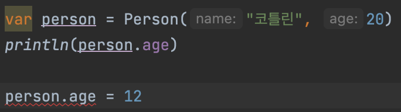

# Getter & Setter
자바에서는 class 를 만들고, 해당 변수를 접근할 때 getter와 setter를 사용하여 관리하였습니다. 

```java
public class Person {

    private String name;
    private Int age;

    public Person(String name, Int age)

    public String getName() {
        return name;
    }

    public Int getAge() {
        return age;
    }

    public void setName(String name) {
        this.name = name
    }

    public void setAge(Int age) {
        this.age = age
    }
}

public class MainClass {
    public static void main(String[] args) {
        Person person = new Person("코틀린", 19);

        System.out.println("이름 : "+person.getName());
        System.out.println("나이 : "+person.getAge());
    }
}
```

하지만 코틀린에서는 getter와 setter를 컴파일 할 때에 생성해준다.
```kotlin
class Person(var name: String, var age: Int)
```
이런 식으로 소괄호 안에 클래스의 속성을 정의합니다. 따라서 우리가 알아야할 부분은 속성의 정의할때 var을 사용하는 것과 val을 사용하는 각각에서 어떻게 작동하는지 알아야 한다.

## 그럼 어떡하는데?
코틀린에서는 선언 방식에 따라 getter와 setter 생성 유무를 지정한다.

| 클래스 선언 | Getter 생성 | Setter 생성 | 유형 |
| -------- | :----------: | :----------: | :---:  |
| class Person(name: String) | x | x | 매개 변수 |
| class Person(var name: String) | o | o | 속성 |
| class Person(val name: String) | o | x | 속성 |

## 유형?
### 매개 변수 선언 방식
```kotlin
class Person(name: String, age: Int)
```
매개 변수 타입으로 선언하게 되면 getter와 setter가 생성이 되지 않아 값을 지정할 수 없다.


### 속성 선언 방식 (var, val)
그렇다면 var과 val 로 참고한 속성은 어떻게 될까

```kotlin
class Person(var name: String, val age: Int)
```
먼저 var 의 경우를 먼저 알아보자면

```kotlin
fun main () {
    val person = Person("김춘식", 20)

    println(person.name)

    person.name = "왕춘삼"

    println(person.name)
}
// 결과
// 김춘식
// 왕춘삼
```

> var 로 설정한 name은 앞에 표에 나온 것과 같이 읽기와 쓰기 모두가 가능하였다.

val로 선언한 속성은??



당연한 상황이지만 읽기는 가능하지만 값을 변경하려하자 에러를 표기한다.
