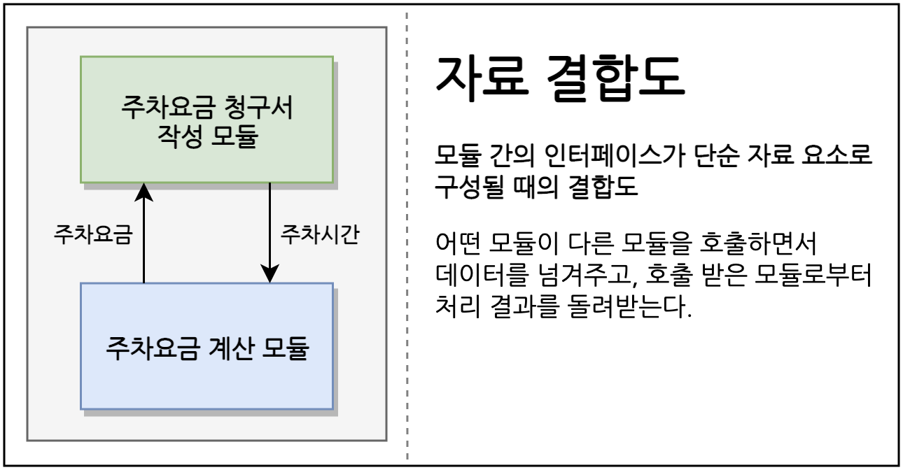
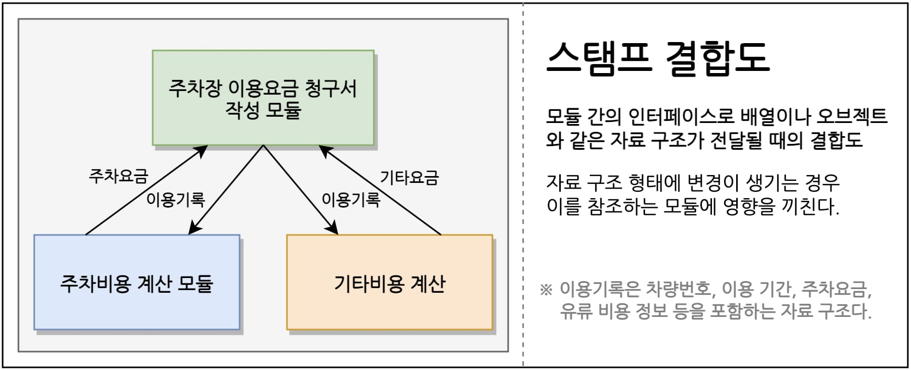
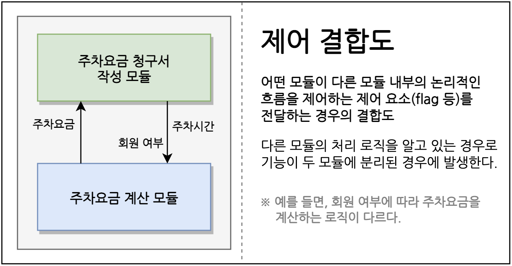

# 결합도(Coupling)
## 결합도란 
* 다른 모듈에 의존하는 정도를 나타내는 것이다. [소프트웨어 공학](https://ko.wikipedia.org/wiki/%EC%86%8C%ED%94%84%ED%8A%B8%EC%9B%A8%EC%96%B4_%EA%B3%B5%ED%95%99)
* 모듈 간에 상호 의존하는 정도 또는 두 모듈 사이의 연결 관계를 의미한다.(2020 시나공 정보처리기사 실기)

간단하게 자바의 클래스로 예를 들면, 결합도가 높은 클래스는 다른 클래스와 연관된 정도가 높다. 따라서 해당 클래스를 변경하면 연관된 클래스도 변경해야 하며, 다른 코드에서 클래스를 재사용하기도 어렵다.

결합도는 아래와 같이 결합 정도에 따라 6개 단계로 구분된다.

## 자료 결합도(Data Coupling)
    가장 낮은 결합도를 갖는다. 가장 좋은 형태다. 모듈끼리 단순히 파라미터 등을 통해 데이터를 주고받는 경우다.

    여기서 주고받는 데이터는 모듈의 기능 수행에 있어서 로직을 제어하거나 하지 않는 순수한 자료형 요소이다. 또한 한 모듈을 변경하더라도 다른 모듈에는 영향을 끼치지 않는 결합 상태이다.



자료 결합도(Data Coupling)의 코드 예제를 살펴보자. 아래와 같이 모듈의 단위를 메서드로 정의했을 때, 다른 메서드에 단순 데이터 타입을 전달한다.

```java
java 

public void main() {
    int result = plusDemo(1,2)
}

// 데이터를 전달한다.

public int plusDemo(int x, int y) {
    return x + y;
}
```


```kotlin
kotlin  

fun main() {
    plusDemo(3,4)
}

fun plusDemo(x : Int, y : Int) {
    return x + y
}
```
## 스탬프 결합도(Stamp Coupling)
    두 모듈이 동일한 자료 구조를 참조하는 형태의 결합도이다. 즉 모듈 간의 인터페이스로 배열 또는 오브젝트 등이 전달되는 경우를 말한다. 자료 구조의 형태가 변경되면 그것을 참조하는 모든 모듈에 영향을 주며 변경 되는 필드를 실제로 참조하지 않는 모듈에도 영향을 준다.




```java

public void foo() {
    // 이름과 메일주소를 생성자로 초기화한다.
    person p = new Person("이현빈","abc@abc.com");
    sendEmail(p);
}

public void sendEmail(Person person) {
    // 메일 발송 로직
}
```

## 제어 결합도(Control Coupling)
    어떤 모듈이 다른 모듈 내부의 논리적인 흐름을 제어하는 요소를 전달하는 경우를 말한다. 예를 들면, 파라미터로 전달되는 값에 따라서 모듈 내부 로직의 처리가 달라지는 Flag 값 등으로 결합되는 형태다.



제어 결합도의 예시를 코드로 살펴보면 다음과 같다.
```java
public void foo() {
    printCharge(true);
}

public void printCharge(boolean isMember) {
    if (isMember) {
        printMemberCharge();
    } else {
        printNormalCharge();
    }
}
```