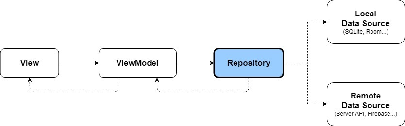

# Repository Pattern
## Repository Pattern이란?
Repository 패턴은 디자인 패턴 중 하나로, 데이터가 있는 여러 장소(Local, Remote)를 추상화하여 중앙 집중처리 방식을 구성하고, 데이터를 사용하는 로직을 분리시키기 위한 디자인 패턴이다.
* 데이터가 있는 여러 저장소(Local Data Source, Remote Data Source)를 추상화하여 **중앙 집중 처리 방식**을 구현할 수 있다.
* 데이터를 사용하는 Domain에서는 **비즈니스 로직에만 집중**할 수 있다. 예를 들어, ViewModel에서는 데이터가 로컬 DB에서 오는지, 서버에서 API 응답을 통해 오는 것인지 **출처를 몰라도 된다.** Repository를 참조하여 Repository가 제공해주는 데이터를 이용하기만 하면 된다.
* Repository가 추상화되어 있으므로 **항상 같은 interface**로 데이터를 요청할 수 있다. ViewModel이 여러 Repository를 공유하더라도 일관된 Interface를 통해 데이터의 일관성 또한 유지할 수 있다.

ViewModel은 필요한 데이터를 Repository에 요청하고 Repository는 적절한 저장소에서 요청받은 데이터를 가져옵니다. **Repository가 추상화되어 있기 때문에 ViewModel은 언제나 같은 인터페이스로 데이터를 요청**할 수 있으며, 실제로 어떤 데이터를 사용하는지 전혀 알 필요가 없기 때문에 앱 환경에 맞는 적절한 데이터를 사용하기에 편리합니다.

## 발생 배경
    비지니스 로직은 프로그램의 핵심이 되는 요소이며, 비지니스 로직을 잘 짜야 원하는 결과를 도출할 수 있다. 이때 비즈니스 로직은 보통 데이터베이스나 웹서비스 등의 데이터 저장소에 접근하게 되는게 이 과정에서 여러 문제가 발생할 수 있다. 
주로 *중복되는 코드, 오류를 발생할 가능성이 있는 코드, 오타, 비즈니스 로직 테스트의 어려움 등*이 있다. 
이에 따라 몇 가지 요구사항이 발생하는데,
* 비즈니스 로직과 데이터 레이어를 **분리**해야하고
* 중앙 집중 처리 방식을 통해 **일관된 데이터와 로직**을 제공해야 한다는 것이다.

## 그래서 왜 쓴다고..?
* 데이터 로직을 분리시킬 수 있다.
* 중앙 집중처리 방식으로, 언제나 일관된 인터페이스로 데이터를 요청할 수 있습니다.
* 그렇기 때문에, 클라이언트가 어떤 데이터를 사용할지 선택할 필요 없이 어떤 데이터를 가져올지는 Repository에서 결정하여 적절한 데이터를 제공한다.
* 단위 테스트를 통해 검증이 가능하다.
* 새로운 데이터 로직 코드를 쉽게 추가할 수 있다.

## 음..!!
* Repository가 추상화되어 있기 때문에 ViewModel에서의 코드 수정 없이도 언제나 같은 인터페이스로 요청할 수 있으며 다양한 환경에 맞는 데이터를 사용할 수 있습니다.
* Repository는 데이터 저장소에 있는 데이터 객체를 캡슐화하고 더 객체지향적인 구조를 제공한다.
* 모델과 비즈니스 로직을 깔끔하게 분리하며 ViewModel -> Model 간의 단방향 의존성 구조를 구현합니다.
* 수많은 ViewModel에서의 호출 또는 복잡한 쿼리르 사용하는 경우 더욱 효과적이다.
* 특히 위와 같은 경우, 같은 로직의 중복을 최소화하는데 큰 이점이 된다.

따라서 이 문제를 해결할 수 있는 디자인 패턴인 **Repository Pattern**이 등장하였다. Repository는 데이터 소스 레이어와 비즈니스 레이어 사이를 중재한다. Repository는 데이터 소스에 쿼리를 날리거나, 데이터에 다른 domain에서 사용할 수 있도록 새롭게 mapping 할 수 있다.

## 장점
    하나의 도메인을 표현하는데 필요한 DataSource가 몇 개 든 client 쪽에서는 이를 알 필요가 없다. 따라서 DataSource가 새롭게 추가되는 것에 대한 부담이 없다.
    DataSource의 변경이 발생하더라도 repository 외부 layer로 전파되지 않는다.
    client는 repository 인터페이스에 의존하기 때문에 테스트하기 용이하다.
    결국 repository는 presentation layer 와 data layer 의 Coupling(결합도)를 느슨하게 만들어준다.
    중간에 추상화된 레이어로서 Repository 클래스를 두어 모듈화가 명확해지고, 유지보수성이 향상된다.

## 단점
    추상레이어가 하나 추가되는 것이므로 관리해야 할 코드와 파일들이 많아진다.

출처 : 
* [[Design Pattern]Repository Pattern 이란](https://4z7l.github.io/2020/11/24/repository-pattern.html)
* [Repository Pattern 이해하기](https://0391kjy.tistory.com/39)